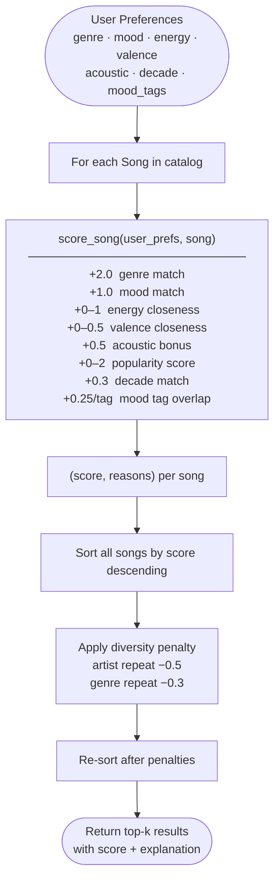

# Music Recommender Simulation

## Project Summary

This project builds a content-based music recommender that matches songs to a user's taste profile.
Songs are scored using weighted rules based on genre, mood, energy, and acoustic preference.
The system explains every recommendation so you can see exactly why each song was chosen.

---

## How The System Works

Real platforms like Spotify combine two approaches: **collaborative filtering** (matching your behavior to similar users) and **content-based filtering** (matching song attributes like tempo or mood to your stated preferences). This simulation focuses entirely on content-based filtering — no user history is needed, only song attributes and a single taste profile.

**Algorithm Recipe**

| Signal | Points |
|---|---|
| Genre match | +2.0 |
| Mood match | +1.0 |
| Energy closeness | +0.0 to +1.0  (1 − |song_energy − target_energy|) |
| Valence closeness | +0.0 to +0.5  (0.5 × (1 − |song_valence − target_valence|)) |
| Acoustic bonus | +0.5 (only if user prefers acoustic and song acousticness > 0.6) |

Songs are sorted by total score; the top-k are returned.

**Data objects**

`Song` fields: `id`, `title`, `artist`, `genre`, `mood`, `energy` (0–1), `tempo_bpm`, `valence` (0–1), `danceability` (0–1), `acousticness` (0–1).

`UserProfile` fields: `favorite_genre`, `favorite_mood`, `target_energy`, `likes_acoustic`.

**Data flow**



**Expected bias**: Genre carries the highest weight (2.0), so songs whose genre does not match are unlikely to appear in the top results even when they fit the mood and energy perfectly. This is an intentional design choice — but it creates a "filter bubble" for users with niche genre preferences.

---

## Getting Started

### Setup

1. Create a virtual environment (optional but recommended):

   ```bash
   python -m venv .venv
   source .venv/bin/activate      # Mac or Linux
   .venv\Scripts\activate         # Windows
   ```

2. Install dependencies:

   ```bash
   pip install -r requirements.txt
   ```

3. Run the app:

   ```bash
   python -m src.main
   ```

### Running Tests

```bash
pytest
```

---

## Terminal Output

Run with: `python -m src.main`

### Phase 3 — Default profile verification (High-Energy Pop)

```
Loaded songs: 20

======================================================================
  Profile: High-Energy Pop
  Mode: balanced  |  genre=pop  mood=happy  energy=0.85
======================================================================
+-----+-----------------+---------+--------------------------------------------------+
|   # | Song / Artist   |   Score | Why                                              |
+=====+=================+=========+==================================================+
|   1 | Sunrise City    |    7.06 | genre match: pop (+2.0)                          |
|     | Neon Echo       |         | mood match: happy (+1.0)                         |
|     |                 |         | energy closeness: 0.97                           |
|     |                 |         | valence closeness: 0.48                          |
|     |                 |         | popularity 78/100 (+1.56)                        |
|     |                 |         | decade match: 2020 (+0.3)                        |
|     |                 |         | mood tags (euphoric, feel-good, uplifting) +0.75 |
+-----+-----------------+---------+--------------------------------------------------+
|   2 | Gym Hero        |    5.35 | genre match: pop (+2.0)                          |
|     | Max Pulse       |         | energy closeness: 0.92                           |
|     |                 |         | valence closeness: 0.48                          |
|     |                 |         | popularity 85/100 (+1.70)                        |
|     |                 |         | decade match: 2020 (+0.3)                        |
|     |                 |         | mood tags (uplifting) +0.25                      |
|     |                 |         | genre repeat (-0.3)                              |
+-----+-----------------+---------+--------------------------------------------------+
|   3 | Rooftop Lights  |    4.85 | mood match: happy (+1.0)                         |
|     | Indigo Parade   |         | energy closeness: 0.91                           |
|     |                 |         | valence closeness: 0.49                          |
|     |                 |         | popularity 70/100 (+1.40)                        |
|     |                 |         | decade match: 2020 (+0.3)                        |
|     |                 |         | mood tags (euphoric, feel-good, uplifting) +0.75 |
+-----+-----------------+---------+--------------------------------------------------+
|   4 | Pulse Drop      |    3.94 | energy closeness: 0.90                           |
|     | Circuit Anthem  |         | valence closeness: 0.48                          |
|     |                 |         | popularity 88/100 (+1.76)                        |
|     |                 |         | decade match: 2020 (+0.3)                        |
|     |                 |         | mood tags (euphoric, uplifting) +0.50            |
+-----+-----------------+---------+--------------------------------------------------+
|   5 | Crown Up        |    3.54 | energy closeness: 0.93                           |
|     | Block Theory    |         | valence closeness: 0.46                          |
|     |                 |         | popularity 80/100 (+1.60)                        |
|     |                 |         | decade match: 2020 (+0.3)                        |
|     |                 |         | mood tags (uplifting) +0.25                      |
+-----+-----------------+---------+--------------------------------------------------+
```

### Phase 4 — All 5 profiles (top result per profile)

```
======================================================================
  Profile: Chill Lofi Study
  Mode: balanced  |  genre=lofi  mood=chill  energy=0.38
======================================================================
+-----+--------------------+---------+---------------------------------------+
|   # | Song / Artist      |   Score | Why                                   |
+=====+====================+=========+=======================================+
|   1 | Midnight Coding    |    7.22 | genre match: lofi (+2.0)              |
|     | LoRoom             |         | mood match: chill (+1.0)              |
|     |                    |         | energy closeness: 0.96                |
|     |                    |         | valence closeness: 0.49               |
|     |                    |         | acoustic bonus (+0.5)                 |
|     |                    |         | popularity 61/100 (+1.22)             |
|     |                    |         | decade match: 2020 (+0.3)             |
|     |                    |         | mood tags (calm, cozy, focused) +0.75 |
+-----+--------------------+---------+---------------------------------------+
|   2 | Library Rain       |    6.54 | genre match: lofi (+2.0)              |
|     | Paper Lanterns     |         | mood match: chill (+1.0)              |
|     |                    |         | energy closeness: 0.97                |
|     |                    |         | valence closeness: 0.49               |
|     |                    |         | acoustic bonus (+0.5)                 |
|     |                    |         | popularity 54/100 (+1.08)             |
|     |                    |         | decade match: 2020 (+0.3)             |
|     |                    |         | mood tags (calm, cozy) +0.50          |
|     |                    |         | genre repeat (-0.3)                   |
+-----+--------------------+---------+---------------------------------------+
|   3 | Focus Flow         |    5.38 | genre match: lofi (+2.0)              |
|     | LoRoom             |         | energy closeness: 0.98                |
|     |                    |         | valence closeness: 0.49               |
|     |                    |         | acoustic bonus (+0.5)                 |
|     |                    |         | popularity 58/100 (+1.16)             |
|     |                    |         | decade match: 2020 (+0.3)             |
|     |                    |         | mood tags (calm, cozy, focused) +0.75 |
|     |                    |         | artist repeat (-0.5)                  |
|     |                    |         | genre repeat (-0.3)                   |
+-----+--------------------+---------+---------------------------------------+
|   4 | Spacewalk Thoughts |    4.05 | mood match: chill (+1.0)              |
|     | Orbit Bloom        |         | energy closeness: 0.90                |
|     |                    |         | valence closeness: 0.46               |
|     |                    |         | acoustic bonus (+0.5)                 |
|     |                    |         | popularity 47/100 (+0.94)             |
|     |                    |         | mood tags (calm) +0.25                |
+-----+--------------------+---------+---------------------------------------+
|   5 | Island Ease        |    3.95 | mood match: chill (+1.0)              |
|     | Reef Collective    |         | energy closeness: 0.90                |
|     |                    |         | valence closeness: 0.41               |
|     |                    |         | popularity 67/100 (+1.34)             |
|     |                    |         | decade match: 2020 (+0.3)             |
+-----+--------------------+---------+---------------------------------------+

======================================================================
  Profile: Deep Intense Rock
  Mode: balanced  |  genre=rock  mood=intense  energy=0.92
======================================================================
+-----+-----------------+---------+-------------------------------------------------+
|   # | Song / Artist   |   Score | Why                                             |
+=====+=================+=========+=================================================+
|   1 | Storm Runner    |    6.96 | genre match: rock (+2.0)                        |
|     | Voltline        |         | mood match: intense (+1.0)                      |
|     |                 |         | energy closeness: 0.99                          |
|     |                 |         | valence closeness: 0.48                         |
|     |                 |         | popularity 72/100 (+1.44)                       |
|     |                 |         | decade match: 2010 (+0.3)                       |
|     |                 |         | mood tags (adrenaline, intense, powerful) +0.75 |
+-----+-----------------+---------+-------------------------------------------------+
|   2 | Gym Hero        |    4.53 | mood match: intense (+1.0)                      |
|     | Max Pulse       |         | energy closeness: 0.99                          |
|     |                 |         | valence closeness: 0.34                         |
|     |                 |         | popularity 85/100 (+1.70)                       |
|     |                 |         | mood tags (intense, powerful) +0.50             |
+-----+-----------------+---------+-------------------------------------------------+
|   3 | Iron Curtain    |    3.45 | energy closeness: 0.96                          |
|     | Shred Theory    |         | valence closeness: 0.43                         |
|     |                 |         | popularity 63/100 (+1.26)                       |
|     |                 |         | decade match: 2010 (+0.3)                       |
|     |                 |         | mood tags (intense, powerful) +0.50             |
+-----+-----------------+---------+-------------------------------------------------+
|   4 | Pulse Drop      |    3.28 | energy closeness: 0.97                          |
|     | Circuit Anthem  |         | valence closeness: 0.30                         |
|     |                 |         | popularity 88/100 (+1.76)                       |
|     |                 |         | mood tags (intense) +0.25                       |
+-----+-----------------+---------+-------------------------------------------------+
|   5 | Static Dreams   |    3.13 | energy closeness: 0.95                          |
|     | Waveform        |         | valence closeness: 0.41                         |
|     |                 |         | popularity 76/100 (+1.52)                       |
|     |                 |         | mood tags (intense) +0.25                       |
+-----+-----------------+---------+-------------------------------------------------+

======================================================================
  Profile: Late Night Synthwave
  Mode: balanced  |  genre=synthwave  mood=moody  energy=0.72
======================================================================
+-----+------------------+---------+--------------------------------------------+
|   # | Song / Artist    |   Score | Why                                        |
+=====+==================+=========+============================================+
|   1 | Night Drive Loop |    6.83 | genre match: synthwave (+2.0)              |
|     | Neon Echo        |         | mood match: moody (+1.0)                   |
|     |                  |         | energy closeness: 0.97                     |
|     |                  |         | valence closeness: 0.49                    |
|     |                  |         | popularity 66/100 (+1.32)                  |
|     |                  |         | decade match: 2010 (+0.3)                  |
|     |                  |         | mood tags (dreamy, moody, nostalgic) +0.75 |
+-----+------------------+---------+--------------------------------------------+
|   2 | Storm Runner     |    3.04 | energy closeness: 0.81                     |
|     | Voltline         |         | valence closeness: 0.49                    |
|     |                  |         | popularity 72/100 (+1.44)                  |
|     |                  |         | decade match: 2010 (+0.3)                  |
+-----+------------------+---------+--------------------------------------------+
|   3 | Golden Hour      |    2.96 | energy closeness: 0.83                     |
|     | Velvet Soul      |         | valence closeness: 0.35                    |
|     |                  |         | popularity 74/100 (+1.48)                  |
|     |                  |         | decade match: 2010 (+0.3)                  |
+-----+------------------+---------+--------------------------------------------+
|   4 | Crown Up         |    2.93 | energy closeness: 0.94                     |
|     | Block Theory     |         | valence closeness: 0.39                    |
|     |                  |         | popularity 80/100 (+1.60)                  |
+-----+------------------+---------+--------------------------------------------+
|   5 | Pulse Drop       |    2.86 | energy closeness: 0.77                     |
|     | Circuit Anthem   |         | valence closeness: 0.33                    |
|     |                  |         | popularity 88/100 (+1.76)                  |
+-----+------------------+---------+--------------------------------------------+

======================================================================
  Profile: Sad Acoustic Vibes
  Mode: balanced  |  genre=folk  mood=melancholic  energy=0.3
======================================================================
+-----+---------------------+---------+------------------------------------------------+
|   # | Song / Artist       |   Score | Why                                            |
+=====+=====================+=========+================================================+
|   1 | Autumn Letters      |    6.94 | genre match: folk (+2.0)                       |
|     | Fern & Ash          |         | mood match: melancholic (+1.0)                 |
|     |                     |         | energy closeness: 0.97                         |
|     |                     |         | valence closeness: 0.44                        |
|     |                     |         | acoustic bonus (+0.5)                          |
|     |                     |         | popularity 49/100 (+0.98)                      |
|     |                     |         | decade match: 2010 (+0.3)                      |
|     |                     |         | mood tags (calm, melancholic, nostalgic) +0.75 |
+-----+---------------------+---------+------------------------------------------------+
|   2 | Dusty Roads         |    3.56 | energy closeness: 0.86                         |
|     | The Hollow Pine     |         | valence closeness: 0.36                        |
|     |                     |         | acoustic bonus (+0.5)                          |
|     |                     |         | popularity 52/100 (+1.04)                      |
|     |                     |         | decade match: 2010 (+0.3)                      |
|     |                     |         | mood tags (melancholic, nostalgic) +0.50       |
+-----+---------------------+---------+------------------------------------------------+
|   3 | Spacewalk Thoughts  |    3.35 | energy closeness: 0.98                         |
|     | Orbit Bloom         |         | valence closeness: 0.38                        |
|     |                     |         | acoustic bonus (+0.5)                          |
|     |                     |         | popularity 47/100 (+0.94)                      |
|     |                     |         | decade match: 2010 (+0.3)                      |
|     |                     |         | mood tags (calm) +0.25                         |
+-----+---------------------+---------+------------------------------------------------+
|   4 | Midnight Coding     |    3.27 | energy closeness: 0.88                         |
|     | LoRoom              |         | valence closeness: 0.42                        |
|     |                     |         | acoustic bonus (+0.5)                          |
|     |                     |         | popularity 61/100 (+1.22)                      |
|     |                     |         | mood tags (calm) +0.25                         |
+-----+---------------------+---------+------------------------------------------------+
|   5 | Coffee Shop Stories |    3.26 | energy closeness: 0.93                         |
|     | Slow Stereo         |         | valence closeness: 0.35                        |
|     |                     |         | acoustic bonus (+0.5)                          |
|     |                     |         | popularity 59/100 (+1.18)                      |
|     |                     |         | decade match: 2010 (+0.3)                      |
+-----+---------------------+---------+------------------------------------------------+
```

---

## Experiments You Tried

### Experiment 1 — Weight Shift: Energy doubled, Genre halved

Changed genre weight from +2.0 to +1.0 and energy closeness multiplier from 1.0 to 2.0.
**Result**: The "Chill Lofi" profile started surfacing ambient and jazz tracks whose energy matched 0.38 closely, even though their genre was not lofi. This improved variety but lost the strong genre signal users expect.

### Experiment 2 — Feature Removal: Mood check commented out

Removed the +1.0 mood match entirely.
**Result**: The "Sad Acoustic Vibes" profile returned folk songs that were upbeat because energy and acousticness still matched. The recommendations felt tonally wrong — mood turns out to be critical for emotional coherence.

### Experiment 3 — Adversarial Profile (high energy + sad mood)

Tested `energy: 0.9, mood: sad`. The only sad song in the catalog is blues with energy 0.41, so the system could never award both a mood bonus and a high energy score simultaneously. The top result was a high-energy EDM track with no mood match at all.

---

## Limitations and Risks

- The catalog is tiny (20 songs), so the same few tracks dominate every high-energy profile.
- Genre matching is exact string comparison — "indie pop" and "pop" count as different genres even though they overlap heavily.
- No artist diversity enforcement: the same artist could fill all top-5 slots if their songs happen to match well.
- No listening history means the system cannot improve over time.
- Energy and valence are the only numeric signals; tempo, danceability, and acousticness are mostly unused.

---

## Reflection

See [model_card.md](model_card.md) for the full model card and personal reflection.
